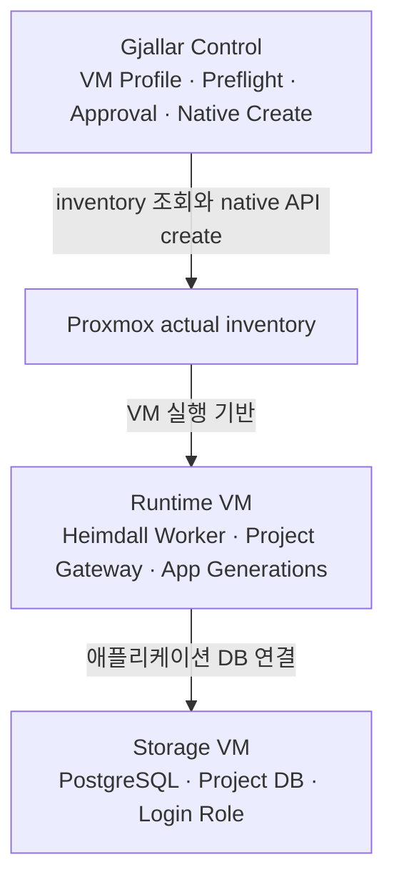
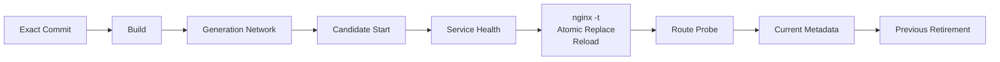
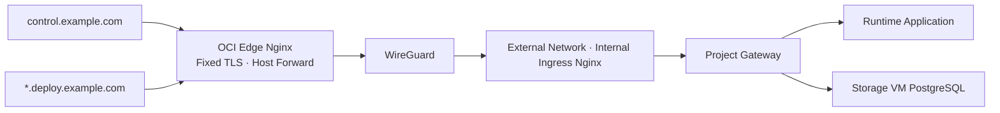

# Portfolio 작업 인수인계

이 문서는 조윤호의 채용 포트폴리오 작업을 다른 Codex 세션이나 다른 컴퓨터에서 바로 이어가기 위한 단일 인수인계 문서다. 대화에서 확정한 프로젝트 서사, 기술적 사실, 표현 경계, 현재 산출물, Git 상태, 검증 방법, 다음 16:9 작업 방향을 한곳에 모았다.

> 2026-08-17 현재 상태: 아래 A4 기록은 의사결정 이력을 보존하기 위한 이전 기준이다. 대표 `/portfolio`와 `output/pdf/yunho-cho-portfolio.pdf`는 14페이지 16:9 편집본으로 교체됐다. 최신 페이지별 설계와 완료 기준은 `docs/portfolio-editorial-brief.md`를 우선한다.

## 0. 가장 먼저 확인할 것

- 저장소: `https://github.com/CodingPenguin-yoon/Portfolio.git`
- 작업 브랜치: `codex/portfolio-document`
- 이전 A4 구현 기준 커밋: `c677b93` (`fix: harden tagged portfolio PDF export`)
- 브랜치 상태: `origin/codex/portfolio-document`에 푸시됨
- `main` 병합: 아직 하지 않음
- Pull Request: 아직 만들지 않음
- 현재 완성본:
  - 웹 미리보기: `/portfolio`
  - PDF: `output/pdf/yunho-cho-portfolio.pdf`
  - 형식: 16:9 가로 14페이지
- 현재 작업: 14페이지 편집본의 문구·근거 화면·면접용 설명을 사용자와 함께 미세 조정

새 세션은 이 문서를 먼저 읽고 다음 세 문서를 필요할 때만 상세 근거로 확인한다.

1. `docs/superpowers/specs/2026-08-17-portfolio-content-architecture.md`
2. `docs/superpowers/specs/2026-08-17-portfolio-evidence-matrix.md`
3. `docs/superpowers/plans/2026-08-17-portfolio-document.md`

## 1. 사용자가 원한 포트폴리오

사용자는 기존 포트폴리오의 문구, 디자인, 구성 모두가 마음에 들지 않아 전면 재구성을 요청했다. 원하는 결과는 다음과 같다.

- 이력서처럼 정석적인 흰색 바탕
- 과장된 슬로건이나 수사적 질문을 사용하지 않는 문체
- 기술 목록보다 `왜 설계했는가`, `어떤 문제가 있었는가`, `어떻게 대응했는가`를 먼저 설명
- 프로젝트가 많아 보이는 것보다 판단력과 문제 해결 방식이 보이는 구성
- 대기업 인사팀과 기술 면접관이 짧은 시간 안에 지원자의 역할과 강점을 이해할 수 있는 문서
- 정석적인 선은 지키되, 책임 분리와 실패 대응 같은 내용에서 지원자만의 특징이 드러나는 결과

### 피해야 할 문체

- 답을 강요하는 수사적 질문
- `완벽한`, `혁신적인`, `무중단`, `안전한`처럼 근거보다 큰 형용사
- 홈랩을 대규모 상용 서비스처럼 과장하는 표현
- 구현 기능과 계획 기능을 한 문장에 섞는 표현
- 팀 프로젝트 전체를 개인 단독 성과처럼 보이게 하는 표현
- 기능 목록만 길게 나열하는 설명

### 유지할 핵심 문장

> 반복되는 인프라 운영과 배포 문제를 자동화하고, 책임 경계와 실패 복구 구조를 설계하는 신입 플랫폼 엔지니어

> 반복 작업을 자동화하는 것에서 시작해, 시스템의 책임 경계와 실패 복구 구조까지 설계했습니다.

## 2. 대화에서 정리된 프로젝트의 시작과 변화

### 2.1 처음 겪은 문제

홈랩 서버에 새 프로그램을 올릴 때마다 다음 작업을 반복해야 했다.

1. VM 생성
2. IP와 네트워크 설정
3. Docker 설치
4. 내부 실행 환경 설정
5. 애플리케이션 배포

반복 작업 자체도 피로했지만, 실행할 때마다 설정이 달라질 수 있고 실패 지점을 추적하기 어렵다는 문제가 있었다. 특히 네트워크 설정과 자동화되지 않은 배포 파이프라인이 가장 큰 불편이었다.

### 2.2 K-Le-PaaS에서 얻은 출발점

K-Le-PaaS가 이 자동화 관점의 출발점이다. 자연어 요청을 해석하고, 실행 가능한 계획으로 정규화하고, Kubernetes·NCP 작업을 실행한 뒤 결과를 사용자에게 되돌려주는 흐름을 만들면서 다음 구조를 경험했다.

```text
입력 → 해석 → 실행 계획 → 작업 실행 → 상태와 결과 피드백
```

이 경험을 진행하면서 `이 구조를 홈랩과 Proxmox 운영에도 적용할 수 있겠다`는 생각으로 Heimdall과 Gjallar의 출발점이 생겼다.

### 2.3 초기 Heimdall

초기 Heimdall은 한 시스템 안에서 다음을 모두 처리하려 했다.

- Terraform 기반 VM 생성
- Ansible 기반 VM 설정
- IP와 네트워크 설정
- Docker 실행 환경 구성
- 애플리케이션 배포

반복 작업은 줄일 수 있었지만 시스템 범위가 너무 커졌고 Terraform·Ansible 의존성까지 함께 관리해야 했다. VM 생성과 애플리케이션 배포가 서로 다른 이유로 변경되고 서로 다른 방식으로 실패한다는 점도 드러났다.

### 2.4 Gjallar와 Heimdall의 분리

비대해진 초기 구조를 계속 확장하는 대신 책임을 나눴다.

- Gjallar: Proxmox 상태를 기준으로 VM 생성 정책, 검증, 승인, native API 실행을 담당
- Heimdall: 애플리케이션의 빌드, 후보 세대 실행, 검증, current 승격을 담당

이 분리는 단순히 프로젝트를 두 개로 나눈 것이 아니다. 인프라 생성 실패와 애플리케이션 릴리스 실패가 서로의 상태와 복구 경로를 오염시키지 않도록 소유권을 분리한 설계 판단이다.

## 3. 포트폴리오가 보여줘야 하는 중심 서사

```text
반복 설정의 피로
  → 자동화 가능성을 K-Le-PaaS에서 경험
  → 초기 Heimdall에 VM 생성과 배포를 통합
  → 범위와 의존성이 과도하게 증가
  → Gjallar와 Heimdall로 책임 분리
  → 정상 경로뿐 아니라 실패·보존·데이터 경계를 설계
```

채용 담당자가 최종적으로 기억해야 할 내용은 다음 네 가지다.

1. 홈랩을 장비 취미가 아니라 실제 운영 문제를 발견하고 검증하는 환경으로 사용했다.
2. 최초 설계가 커졌을 때 기능을 계속 붙이지 않고 변경 이유와 실패 영향을 기준으로 책임을 다시 나눴다.
3. 정상 배포뿐 아니라 실패 시 기존 서비스와 사용자 데이터를 어디까지 보존할지 고민했다.
4. 현재 구현, 사용자 확인 운영 구조, 이전 설계, 향후 계획을 구분해서 설명한다.

## 4. 프로젝트별 역할과 표현 경계

### 4.1 K-Le-PaaS

- 상태: 이전 프로젝트, 구현 근거 확인
- 기간: `2025.09 - 2025.12`
- 팀 규모: 2인
- 팀 전체 흐름:
  - 자연어 요청
  - 의도·대상 해석
  - CommandPlan 생성
  - Kubernetes·NCP 작업
  - 실행 결과 기록
- 확인된 개인 기여:
  - Gemini 기반 의도·엔티티 해석
  - Pod·Service·Deployment 상태 조회와 재시작 명령 계획
  - Ingress 도메인 변경과 배포 URL 동기화
  - Prometheus 메트릭과 NKS 리소스 화면 연결
- 개인 소유 설계 판단:
  - 자연어 요청을 바로 실행하지 않고 의도와 대상을 CommandPlan으로 정규화한 뒤 실행 경계에 연결
- 표현 주의:
  - 팀 성과와 개인 기여를 반드시 분리
  - Kubernetes·NCP 기능 전체를 개인 단독 구현처럼 쓰지 않음

### 4.2 Gjallar

- 상태: 현재 구현
- 핵심 역할: Proxmox native API 기반 VM 생성 자동화
- 실제 구현 범위:
  - Proxmox actual inventory 조회
  - DB-backed VM Profile 정책
  - CPU·메모리·디스크·access 권장 범위 재사용
  - template, guest agent, cloud-init readiness 확인
  - 고정 IP, bridge, storage, template preflight
  - draft → preflight → plan → approval → preview → acknowledgement
  - native clone/config/task API 실행
  - 기본 stopped create
  - 선택적인 boot and verify
  - job·artifact·observed-after 근거 보존
- 제거한 의존성:
  - Terraform executor
  - Ansible 기반 active path
- 표현 주의:
  - VM 수명주기 전체를 관리한다고 쓰지 않음
  - destructive control이 구현됐다고 쓰지 않음
  - 현재 운영 기능은 native Create와 제한된 gated Start 범위로 한정

### 4.3 Heimdall

- 상태: 현재 구현
- 핵심 역할: 애플리케이션 Deployment Generation 생성·검증·승격
- 실제 구현 범위:
  - GitHub 프로젝트와 main 배포 요청
  - 고정 commit checkout과 설정 snapshot
  - Docker image build
  - generation별 network와 고유 service alias
  - 단일·다중 서비스 candidate 실행
  - service health 확인
  - Nginx 설정 생성과 `nginx -t`
  - atomic config replace
  - Nginx reload
  - 실제 route probe
  - 성공 후 current metadata 전환
  - 성공이 완전히 확정된 뒤 previous generation 회수
  - 프로젝트별 PostgreSQL DB·login role·schema 권한 생성
  - 선언된 서비스에만 DB credential 주입
  - worker 재시작 시 Control DB, Nginx marker, Docker label reconciliation
  - 정확한 project/deployment label과 일치하는 candidate cleanup
  - 배포 진단과 서비스 로그에서 민감정보 마스킹
- 표현 주의:
  - 저장된 이미지로 즉시 되돌리는 release rollback은 구현되지 않음
  - 과거 commit 재빌드와 stored-image rollback을 같은 기능처럼 쓰지 않음
  - DB purge, rotation, backup, restore는 구현되지 않음
  - 사용자 데이터 rollback은 구현되지 않음

### 4.4 Argus

- 상태: 구현된 보조 프로젝트
- 포트폴리오 역할: 다른 문제에서도 입력 경계를 분리하는 원칙을 적용했다는 보조 근거
- 보여줄 범위:
  - 공급자별 adapter
  - normalized snapshot
  - 판단 흐름
  - 대시보드
- 표현 주의:
  - Heimdall·Gjallar와 같은 중심 프로젝트로 확대하지 않음

## 5. 현재 시스템 구조

현재 시스템은 실행 기반, VM 자동화, 배포 자동화, 사용자 데이터를 서로 다른 수명주기로 다룬다.



### 책임 경계

| 영역       | 소유 책임                     | 변경 이유               | 실패 영향              |
| ---------- | ----------------------------- | ----------------------- | ---------------------- |
| Proxmox    | 실제 VM inventory와 실행 기반 | 물리·가상 자원 상태     | VM 실행 기반 생성 실패 |
| Gjallar    | VM 생성 요청의 정책·검증·실행 | 인프라 용량과 구성 변경 | 승인된 VM 생성 실패    |
| Runtime VM | 애플리케이션 generation 실행  | 애플리케이션 릴리스     | 후보 세대 실패         |
| Heimdall   | 빌드·검증·current 승격        | 코드와 설정 변경        | 후보 미승격            |
| Storage VM | 사용자 데이터 수명주기        | 데이터와 운영 정책      | 데이터 계층 장애       |

### Storage VM을 분리한 이유

별도 PostgreSQL VM 운영은 사용자가 확인한 실제 운영 구조다. 분리 이유는 다음 두 가지다.

1. 향후 Kubernetes 이전 시 사용자 데이터 마이그레이션 경계를 애플리케이션 실행 세대와 분리하기 위해서다.
2. 애플리케이션 배포와 교체가 사용자 데이터의 수명주기를 함께 흔들지 않도록 운영 안정성을 확보하기 위해서다.

주의할 점은 별도 Storage VM이 기본 Compose가 자동으로 만드는 물리 격리 기능은 아니라는 것이다. Heimdall 코드는 외부 PostgreSQL endpoint와 프로젝트별 DB provisioning을 지원하고, 별도 VM은 사용자 확인 운영 구조로 표현한다.

## 6. Heimdall 배포와 실패 처리

### 6.1 정상 승격 경로



`candidate 실행 성공`과 `운영 트래픽 활성화 성공`은 같은 판정이 아니다.

- candidate가 시작되고 service health를 통과해도 아직 current가 아니다.
- Nginx 설정 검증, atomic replace, reload, 실제 route probe까지 통과해야 current metadata를 전환할 수 있다.
- previous generation은 서비스가 완전히 성공한 뒤에만 바뀌고 회수된다.

### 6.2 실패 시 보존 범위

- Build 또는 health 실패:
  - 실패한 deployment ID와 label이 정확히 일치하는 candidate만 정리
  - 기존 current와 active metadata 유지
- Nginx activation 또는 route probe 실패:
  - last-known-good 설정 복원
  - 이전 route와 generation 유지
  - 이것을 stored-image release rollback이라고 부르지 않음
- Worker 중단 또는 상태 불확실:
  - Control DB, Nginx marker, Docker label 비교
  - 상태를 확정할 수 없으면 자동 삭제보다 candidate 보존
- 애플리케이션과 데이터:
  - runtime generation과 PostgreSQL 데이터 실패 범위를 분리
  - DB backup·restore와 user data rollback은 비범위

## 7. 계획된 외부 공개 구조

외부 공개 구조는 아직 `Planned`다. OCI를 배포마다 수정하는 구조가 아니라 OCI는 고정된 외부 Edge로 두고, 동적 도메인 중계와 라우팅은 홈랩 내부가 소유한다.

### DNS 분리

- `control.example.com`: 사용자 전용 Control Web
- `*.deploy.example.com`: 사용자 배포 서비스 전용 wildcard DNS

### 계획 경로



확정된 것은 방향과 책임 경계다. 실제 도메인, IP, 인증서, secret, 방화벽 규칙은 포트폴리오에 넣지 않는다.

## 8. 현재 A4 포트폴리오

### 페이지 구성

| 페이지 | 역할                 | 핵심 주장                                     |
| ------ | -------------------- | --------------------------------------------- |
| 01     | Cover                | 어떤 엔지니어인지 즉시 제시                   |
| 02     | Profile              | 프로젝트를 플랫폼 운영이라는 한 문제로 연결   |
| 03     | Origin               | 반복 VM·네트워크·Docker·배포 작업이 출발점    |
| 04     | Evolution            | 비대한 자동화를 두 책임으로 분리              |
| 05     | K-Le-PaaS            | 입력·실행·피드백 구조의 출발점                |
| 06     | Current System       | Proxmox·Gjallar·Runtime·Storage 책임 지도     |
| 07     | Responsibility Split | VM 생성과 배포의 변경·실패 경계 비교          |
| 08     | Gjallar              | Proxmox actual state 기반 반복 가능한 VM 생성 |
| 09     | Heimdall Promotion   | 검증된 candidate만 current 승격               |
| 10     | Failure Design       | 실패할수록 자동 삭제보다 보존 범위를 좁힘     |
| 11     | Planned Architecture | OCI 고정 Edge와 내부 동적 라우팅 계획         |
| 12     | Argus                | 입력 경계 분리 원칙의 보조 근거               |
| 13     | Resume & Contact     | 프로젝트 범위와 지원자 정보 요약              |

### 디자인 시스템

- 흰색 바탕
- A4 세로
- IBM Plex Sans KR 중심
- 페이지 번호와 일부 라벨은 mono 계열
- 검정·짙은 회색 본문과 절제된 teal accent
- 구현·이전·계획 상태 badge
- 한 페이지에 하나의 주장
- 장식 이미지보다 실제 실행 화면과 구조도 우선
- 스크린샷은 5, 8, 12페이지에만 사용
- 내부 IP, secret, 인증서, 계정 정보는 표시하지 않음

### 현재 산출물 특성

- 13페이지 모두 정확한 A4 MediaBox
- Tagged PDF
- 문서 언어 `ko`
- 폰트 embedded/subset/Unicode mapping
- 이미지 객체는 5, 8, 12페이지에만 존재
- 원자적 PDF 교체
  - 같은 디렉터리의 고유 임시 파일에 기록
  - 기록된 byte를 다시 확인
  - 성공 후 atomic rename
  - 실패 시 기존 canonical PDF 보존과 임시 파일 정리

## 9. 검증된 구현 근거

상세 파일과 테스트 위치는 `docs/superpowers/specs/2026-08-17-portfolio-evidence-matrix.md`가 기준이다.

### Heimdall 현재 저장소

- 로컬 경로: `/Users/yoon/03_projects/04_my_vm_proxmox/heimdall_final`
- 검증 HEAD: `b4bda10`
- 실행한 안전한 집중 단위 테스트: 9개 통과
- 실제 Docker, PostgreSQL, 외부 Git checkout이 필요한 integration은 집중 실행에서 제외
- 저장소는 검증 전후 clean 상태 확인

### Gjallar

- 로컬 경로: `/Users/yoon/03_projects/04_my_vm_proxmox/01_Gjallar`
- 집중 검증 결과: `32 passed, 7 subtests passed`

### K-Le-PaaS

- 로컬 경로: `/Users/yoon/03_projects/zz_past_project/klepaas_project/backend_klepaas_test`
- 개인 기여는 작성 commit과 구현 파일로 분리해 확인

### Argus

- 로컬 경로: `/Users/yoon/03_projects/05_economy_project/argus_renewal`
- 공급자 adapter, snapshot, 판단 흐름, 대시보드를 보조 근거로 사용

다른 컴퓨터에 위 저장소들이 없으면 기존 evidence matrix보다 강한 주장을 새로 추가하지 않는다. 새로운 주장을 추가하려면 해당 저장소와 실행 근거를 다시 확보한다.

## 10. 현재 Git과 파일 상태

### 브랜치

```text
codex/portfolio-document
```

### 원격

```text
origin https://github.com/CodingPenguin-yoon/Portfolio.git
```

### 구현 기준 커밋

```text
c677b93 fix: harden tagged portfolio PDF export
```

이 인수인계 문서는 `c677b93` 이후 별도 문서 커밋으로 추가된다. 따라서 새 컴퓨터에서는 특정 SHA보다 원격 브랜치의 최신 HEAD를 우선 확인한다.

### 수정하지 않은 기존 범위

포트폴리오 문서 작업은 다음 기존 홈페이지·이력서 소스를 변경하지 않았다.

- `src/pages/index.astro`
- `src/pages/resume.astro`
- `src/data/home.ts`
- `src/data/resume.ts`
- `src/data/portfolio.ts`

### 핵심 구현 파일

- `src/pages/portfolio/index.astro`
- `src/components/portfolio-document/PortfolioDocument.astro`
- `src/components/portfolio-document/PortfolioPage.astro`
- `src/components/portfolio-document/ArchitectureMap.astro`
- `src/components/portfolio-document/FlowDiagram.astro`
- `src/components/portfolio-document/EvidenceFigure.astro`
- `src/components/portfolio-document/StatusBadge.astro`
- `src/assets/styles/portfolio-document.css`
- `src/data/portfolio-document.ts`
- `scripts/export-portfolio-pdf.mjs`
- `scripts/check-portfolio-format.mjs`
- `tests/portfolio-document-data.spec.ts`
- `tests/portfolio-document-route.spec.ts`
- `tests/portfolio-document-pdf.spec.ts`

## 11. 다른 컴퓨터에서 시작하는 방법

```bash
git clone https://github.com/CodingPenguin-yoon/Portfolio.git
cd Portfolio
git fetch origin
git switch --track origin/codex/portfolio-document
npm ci
npx playwright install chromium
```

macOS에서 PDF 검증 도구가 없다면 Poppler를 설치한다.

```bash
brew install poppler
```

`package.json`의 실제 Node engine 범위를 확인한 뒤 그 범위에 맞는 Node를 사용한다. 기존 구현 검증은 Node 24에서 완료됐으며 Node 18 호환 API를 사용했지만, 최종 exporter를 Node 18에서 별도로 실행한 기록은 없다.

### 전체 검증

```bash
npm run check:astro
npm run check:eslint
npm run check:portfolio-format
npm run build
npm run test:portfolio
```

마지막 전체 검증 결과:

```text
Astro: 0 errors, 0 warnings, 0 hints
ESLint: pass
Portfolio format gate: pass
Build: pass
Playwright: 35 passed
```

### PDF 재생성

터미널 1:

```bash
npm run preview -- --host 127.0.0.1 --port 4322
```

터미널 2:

```bash
npm run portfolio:pdf
```

### PDF 구조 검증

```bash
pdfinfo -f 1 -l 13 -box output/pdf/yunho-cho-portfolio.pdf
pdffonts output/pdf/yunho-cho-portfolio.pdf
pdfimages -list output/pdf/yunho-cho-portfolio.pdf
pdftotext -layout output/pdf/yunho-cho-portfolio.pdf -
pdftoppm -r 144 -png \
  output/pdf/yunho-cho-portfolio.pdf \
  tmp/pdfs/pages/page
```

시각 QA가 끝난 `tmp/pdfs/` PNG는 최종 산출물이 아니므로 삭제해도 된다. 최종 PDF는 `output/pdf/yunho-cho-portfolio.pdf` 하나만 유지한다.

## 12. 다음 작업: 16:9 포트폴리오

사용자는 현재 A4 포트폴리오를 본 뒤 16:9 형식으로 만들고 싶다는 의사를 밝혔다. 이 방향은 아직 구현되지 않았다.

### 판단

16:9가 프로젝트 내용과 더 잘 맞을 가능성이 크다.

- Gjallar와 Heimdall의 책임 분리 비교가 가로축에 적합하다.
- Proxmox → Runtime → Storage 구조를 더 크게 보여줄 수 있다.
- candidate → 검증 → current 승격 흐름이 한 화면에서 읽힌다.
- OCI → WireGuard → 내부 Ingress 구조를 축소하지 않고 표현할 수 있다.

### 중요한 원칙

현재 A4를 단순히 가로로 늘리지 않는다. 16:9는 슬라이드 문법으로 다시 편집해야 한다.

- 한 슬라이드에 한 주장
- 본문 문장을 줄이고 구조도를 크게 배치
- 발표 자료처럼 과도한 장식과 애니메이션은 사용하지 않음
- 흰색, 검정·회색, teal의 기존 채용 문서 톤 유지
- 구현·이전·계획 상태 구분 유지
- 기존 evidence matrix를 단일 사실 공급원으로 사용

### 권장 산출물 전략

기존 A4를 바로 덮어쓰지 말고 16:9를 별도 산출물로 만든다.

- A4 채용 문서: 계속 유지
- 16:9 인터뷰·화면 열람용 포트폴리오: 새 route와 새 PDF로 추가
- 16:9가 최종 승인된 뒤 어떤 파일을 대표 포트폴리오로 둘지 결정

권장 경로 예시:

```text
/portfolio/presentation
output/pdf/yunho-cho-portfolio-16x9.pdf
```

이 경로는 아직 확정된 요구사항이 아니다. 구현 전에 사용자에게 `A4와 공존`할지 `16:9로 대표본을 교체`할지 확인한다.

### 권장 11슬라이드 초안

1. Cover — 조윤호 / Platform Engineer / 한 줄 정의
2. Problem — VM·IP·Docker·배포 반복 작업
3. Evolution — K-Le-PaaS → 초기 Heimdall → 책임 분리
4. Current System — Proxmox·Gjallar·Runtime·Storage 전체 지도
5. Responsibility Split — Gjallar와 Heimdall 비교
6. Gjallar — Profile·Preflight·Approval·Native Create
7. Heimdall — Candidate에서 Current까지의 승격
8. Failure Boundary — 보존·복구·비범위
9. Planned Exposure — 이중 DNS·OCI·WireGuard·내부 라우팅
10. K-Le-PaaS & Argus — 출발점과 보조 근거
11. Resume & Contact — 프로젝트 범위·기술·연락처

슬라이드 수는 10~12장 범위가 적절하다. A4의 13페이지를 기계적으로 13슬라이드로 옮길 필요는 없다.

## 13. 새 세션에서 먼저 결정할 질문

16:9 작업을 시작하기 전에 다음 질문을 한 번에 하나씩 확인한다.

1. 기존 A4와 16:9를 공존시킬 것인가, 대표본을 교체할 것인가?
2. 16:9의 주 사용 상황은 채용 사이트 업로드인가, 면접 발표인가, 화면 열람용 PDF인가?
3. 16:9도 11슬라이드 내외의 정석적인 흰색 문서 톤으로 유지할 것인가?
4. 현재 13페이지 중 반드시 독립 슬라이드로 남길 페이지는 무엇인가?

합리적인 기본 가정은 `A4 유지 + 별도 16:9 추가 + 흰색 채용 문서 톤 + 11슬라이드`다.

## 14. 알려진 비차단 기술 메모

최종 통합 리뷰는 `Critical 0`, `Important 0`, 병합 가능으로 승인됐다. 다음 세 항목은 현재 산출물을 막지 않는 테스트·문서 하드닝 메모다.

1. `PORTFOLIO_FORMAT_BASE` 환경 변수가 잘못된 값이어도 format script가 `main` 또는 `origin/main`으로 fallback한다. 명시적으로 설정된 잘못된 값은 fail-closed로 처리하는 개선 여지가 있다.
2. README의 Node 설명보다 `package.json`의 engine range가 더 정확하다. 새로운 환경에서는 README 문장만 믿지 말고 engine range를 확인한다.
3. PDF 이미지 테스트는 현재 `type=image` row를 검사한다. 예상하지 않은 `mask` 또는 `smask` raster object까지 fail하도록 강화할 수 있다.

현재 canonical PDF에는 mask/smask가 없고, 위 항목들은 시각 결과나 채용 내용의 결함이 아니다.

## 15. 상태 표기 규칙

새 내용을 추가할 때 다음 상태를 반드시 유지한다.

- `Implemented`: 현재 코드와 테스트 또는 실행 근거가 확인됨
- `User-confirmed` 또는 `Operational`: 사용자가 설명한 실제 운영 구조이며 코드 기본 구성과 구분해야 함
- `Previous`: 이전에 사용했지만 현재 구조는 아님
- `Planned`: 방향과 책임 경계만 확정됐으며 구현되지 않음
- `Not implemented`: 구현 범위가 아니므로 성과처럼 표현하면 안 됨

상태를 확신할 수 없으면 더 강한 표현을 쓰지 않는다. 근거를 추가하거나 상태를 낮춘다.

## 16. 새 AI 세션에 전달할 시작 프롬프트

다음 문장을 새 세션의 첫 요청으로 사용할 수 있다.

```text
이 저장소의 `doc/PORTFOLIO_HANDOFF.md`를 먼저 끝까지 읽고,
`docs/superpowers/specs/2026-08-17-portfolio-evidence-matrix.md`를 사실 기준으로 사용해줘.

현재 `codex/portfolio-document` 브랜치에는 검증된 A4 13페이지 포트폴리오가 있고,
기존 홈페이지와 이력서 소스는 건드리지 않은 상태야.

다음 목표는 기존 A4를 단순 확대하지 않고 흰색 기반 16:9 포트폴리오를 별도 산출물로 설계하는 거야.
먼저 A4 공존 여부와 사용 상황을 확인한 뒤, 구현·계획 경계를 유지한 10~12슬라이드 구조를 제안해줘.
검증되지 않은 기능을 추가하거나 Heimdall의 activation 복구를 stored-image rollback으로 표현하면 안 돼.
```

## 17. 완료 기준

이후 작업도 다음 기준을 만족해야 한다.

- 기존 홈페이지와 이력서 소스를 명시적 승인 없이 변경하지 않음
- 프로젝트 주장이 evidence matrix를 넘지 않음
- K-Le-PaaS 팀 성과와 개인 기여를 분리
- Gjallar를 VM lifecycle 전체 관리자로 과장하지 않음
- Heimdall의 activation 복구와 release rollback을 구분
- Storage VM 운영 구조와 코드 기본 Compose를 구분
- planned external architecture를 implemented처럼 표현하지 않음
- 결과물의 실제 크기와 출력 매체를 자동 테스트
- PDF 폰트, 이미지, text extraction, 페이지 geometry를 검증
- 전체 페이지를 raster render로 직접 확인
- 최종 산출물 외 QA 파일은 정리
- 작업 완료 후 브랜치, 커밋, 푸시 또는 PR 상태를 명시
